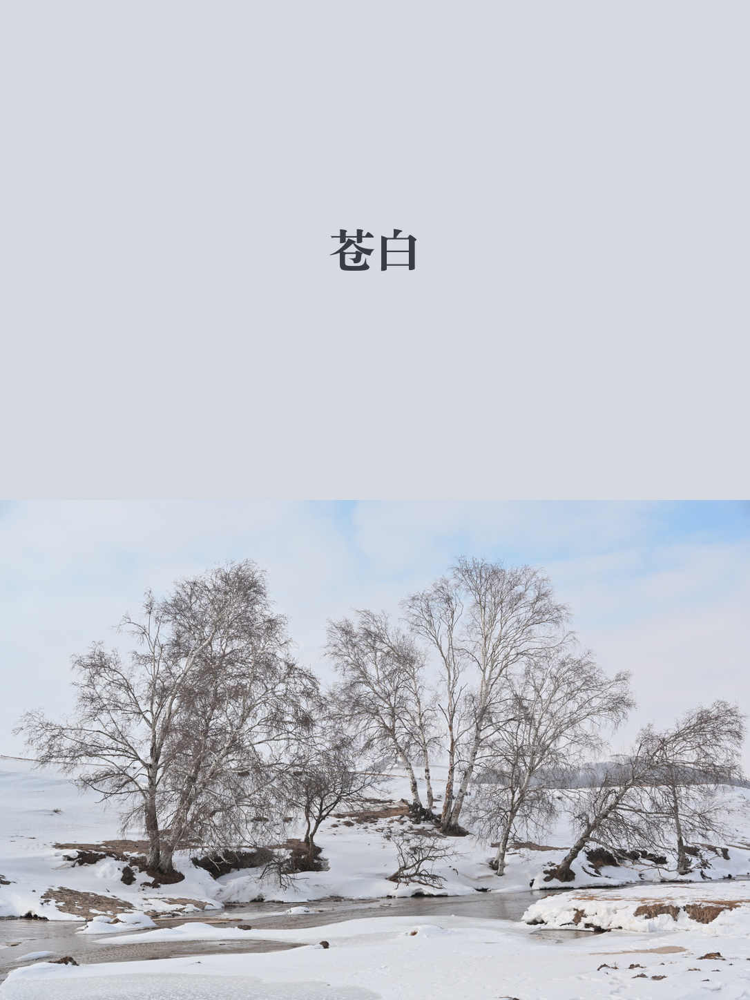

# 霜色拾韵

从图片中提取核心颜色，匹配中国传统色名，生成带文字的纯色色卡，并与原图无损拼接的 Codex skill。



## 能做什么

- 提取图片中最具代表性的核心色
- 匹配相近的中国传统色名称
- 生成与原图同尺寸的纯色色卡
- 在色卡中央写入传统色名
- 支持上下或左右拼接，色卡可放在上、下、左、右
- 默认输出 PNG，避免对原图区域进行二次 JPEG 压缩

## 使用场景

适合这样的请求：

```text
提取这张图片的核心颜色，找一个对应的中国风颜色名称，生成色卡并和原图上下拼接。
```

```text
把色卡放在左边，字体小一点，换成宋体风格。
```

## 安装

把本仓库作为 skill 放入 Codex skills 目录：

```bash
git clone https://github.com/onlyWillow/shuangse-shiyun.git ~/.codex/skills/shuangse-shiyun
```

之后在 Codex 中提出相关图片取色、传统色命名、色卡拼接需求时，这个 skill 会被触发。

## 脚本用法

也可以直接运行内置脚本：

```bash
python3 scripts/chinese_color_card.py /path/to/image.jpeg \
  --out-dir outputs \
  --orientation vertical \
  --card-position top \
  --font-style songti \
  --font-scale 0.0625
```

常用参数：

- `--orientation vertical|horizontal`：上下或左右拼接
- `--card-position top|bottom|left|right`：色卡位置
- `--font-style songti|kaiti|heiti|pingfang`：中文字体风格
- `--font-size 68`：指定字号
- `--color-name 苍白`：手动覆盖传统色名
- `--core-hex '#D4D9E2'`：手动覆盖核心色

## 示例结果

上方参考图来自一次雪景照片处理：

- 原图尺寸：`1086 x 724`
- 提取核心色：`#D4D9E2`
- 匹配传统色名：`苍白`
- 拼接方式：色卡在上，原图在下
- 输出尺寸：`1086 x 1448`

## 参考来源

- [中国色](https://zhongguose.com/)
- [Chinese Color Atlas](https://chinesecoloratlas.com/colors)
